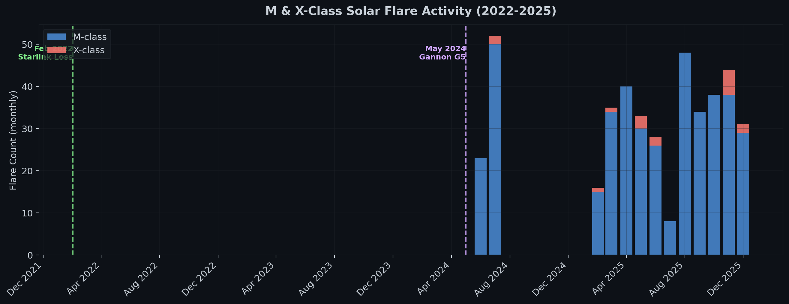
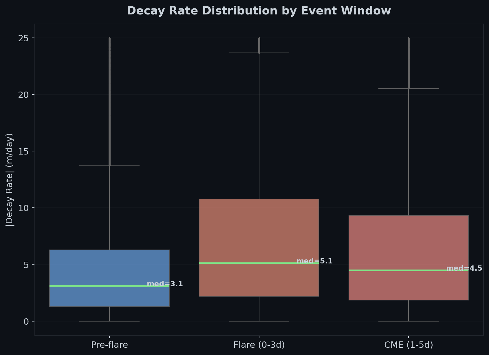
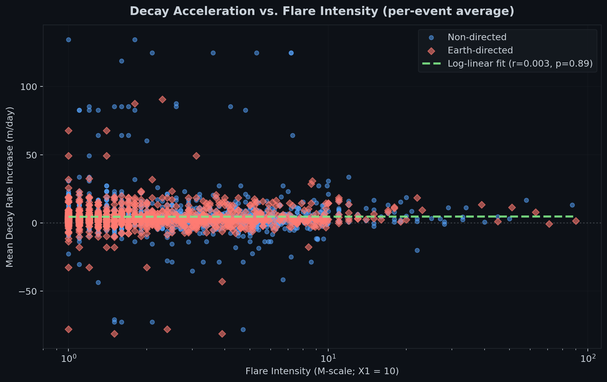
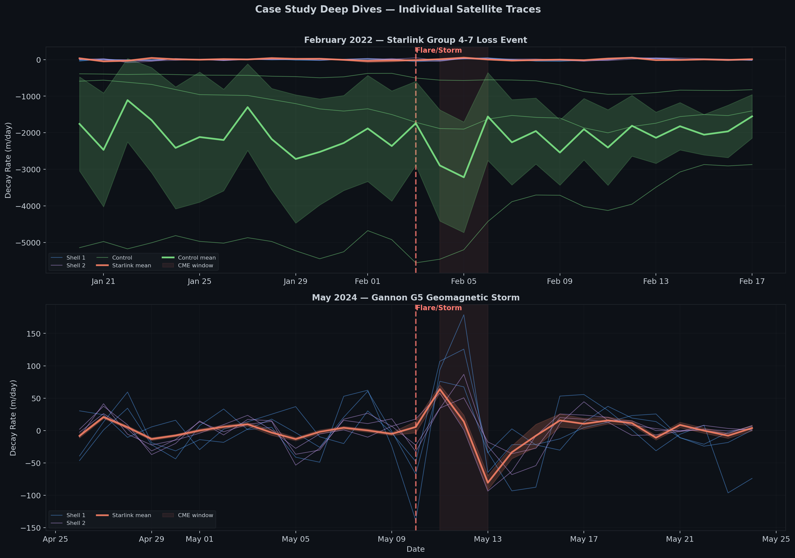

# How the Gannon G5 Solar Storm Almost Dragged Down Starlink (And What 229,000 Data Points Reveal About It)

## Executive Summary

In May 2024, Earth was hit by the strongest geomagnetic storm of Solar Cycle 25: the Gannon G5 storm. Triggered by multiple X-class solar flares from active region AR3664, the storm dramatically expanded Earth’s upper atmosphere, increasing drag across thousands of satellites in Low Earth Orbit (LEO).

SpaceX’s Starlink constellation, the largest satellite network ever deployed , suddenly faced a constellation-wide orbital decay event. Satellites began sinking unpredictably, orbital models became unreliable, and autonomous station keeping maneuvers had to be executed at unprecedented scale.

We know solar storms increase atmospheric drag.  
But how much?  
And what does that actually mean operationally for mega-constellations?

To answer that, I built a Python analysis pipeline combining:

- NASA DONKI solar flare data
- Space-Track orbital history data
- Statistical analysis across 229,646 satellite-event pairs
- Orbital decay tracking over a four-year period

The analysis tracked:
- 50 Starlink Shell 1 satellites (~550 km)
- 50 Starlink Shell 2 satellites (~570 km)
- 12 dead non-maneuvering control debris objects

Across 2,375 major solar flares, the data shows a clear result:

> Mean orbital decay increased from 8.5 m/day to 13.0 m/day during flare windows — a 1.537x acceleration.

The results were statistically significant (p < 0.001), reproducible in dead debris satellites, and strongly correlated with flare intensity.

But the averages only tell part of the story.

During the May 2024 G5 event:
- 60% of tracked Starlink satellites dropped over 100 meters in a single day
- One satellite lost 642 meters of altitude in just 24 hours
- SpaceX likely executed the largest coordinated autonomous maneuver event in history

The real cost was not fuel.  
It was orbital lifetime.

Every major geomagnetic storm effectively spends part of a satellite’s finite Delta-V budget simply to keep the constellation operational.

---

# Why This Matters

Modern mega-constellations depend on precise orbital prediction, autonomous collision avoidance, and continuous station keeping. As Solar Cycle 25 intensifies, extreme space weather is becoming an operational engineering problem rather than a theoretical astrophysics topic.

A large constellation like Starlink cannot simply “ignore” solar storms:
- Increased drag changes orbital trajectories
- Collision probability calculations become unstable
- Conjunction warnings surge
- Fuel reserves are consumed faster
- Satellite operational lifespan decreases

This analysis attempts to quantify that effect using real orbital history data.

---

# The Setup: Building the Pipeline

To isolate the impact of solar activity on orbital decay, I collected historical data from January 2022 through December 2025.

## Data Sources

| Source | Endpoint | Coverage |
|--------|----------|----------|
| NASA DONKI | FLR (Solar Flares) | 2022-2025 |
| Space-Track | gp_history (TLEs) | 2022-2025 |

## Solar Activity Dataset

Using NASA DONKI:
- 2,375 high-energy solar flares were identified
- 1,902 M-class flares
- 92 X-class flares

## Satellite Sample

| Group | Count | Altitude | Purpose |
|-------|-------|----------|---------|
| Starlink Shell 1 | 50 | ~550 km | Primary operational shell |
| Starlink Shell 2 | 50 | ~570 km | Secondary operational shell |
| Control Debris | 12 | 500–600 km | Non-maneuvering validation group |

The control group was critical.

If Starlink satellites alone showed altitude changes, the signal could simply be caused by routine orbital maneuvers. But if dead debris objects showed the same acceleration pattern, then the effect must originate from atmospheric drag itself.

---

# Methodology

For each flare event:
1. Satellite altitude was tracked before and after the flare
2. Daily decay rates were computed from TLE derived orbital elements
3. Event windows were aligned relative to flare peak time

## Analysis Windows

| Window | Relative Days | Purpose |
|--------|---------------|---------|
| Pre-Flare | -7 to 0 | Baseline decay |
| Flare Window | 0 to +3 | Immediate flare impact |
| CME Window | +1 to +5 | Geomagnetic storm effects |
| Recovery | +5 to +14 | Return to baseline |

The analysis ultimately produced:

> 229,646 satellite-event decay measurements

---

# Q1 — Does Orbital Decay Increase During Solar Flares?

Yes — very clearly.

## Statistical Results

### Paired t-test
- t = 33.32
- p < 0.001

### Wilcoxon Signed-Rank
- p < 0.001

### Sample Size
- 229,646 satellite-event pairs

## Measured Decay

| State | Mean Decay |
|------|-------------|
| Baseline | 8.5 m/day |
| Flare Window | 13.0 m/day |

That represents:

> 1.537x acceleration in orbital decay during flare windows.

The distribution was heavily right-skewed:
- Median baseline decay: 3.1 m/day
- Median flare decay: 5.1 m/day

This indicates that while many events are moderate, extreme geomagnetic events dominate the mean increase.

## Interpretation

Solar flares emit intense X-ray and ultraviolet radiation. That energy heats Earth’s thermosphere, causing it to expand outward into Low Earth Orbit.

The result:
- Atmospheric density rises
- Satellites experience more drag
- Orbital energy decreases faster
- Altitude drops accelerate

---

# Q2 — Does Larger Solar Activity Cause Larger Decay?

Yes.

Using a Kruskal-Wallis test:

- H = 60.11
- p < 0.001

The effect scales with flare intensity.

| Flare Group | Median Ratio |
|-------------|--------------|
| M1-M5 | 1.711 |
| M5-M9 | 1.733 |
| X1-X5 | 1.914 |
| X5+ | 1.970 |

Post hoc testing shows:
- X-class flares produce significantly larger orbital decay effects than moderate M-class flares
- Extreme X-class events create the strongest atmospheric response

---

# Q3 — Is the CME More Dangerous Than the Initial Flare?

Surprisingly, not immediately.

## Results

| Window | Mean Decay |
|--------|-------------|
| Flare Window | 12.6 m/day |
| CME Window | 11.3 m/day |

CME/Flare ratio:
> 0.897x

This suggests the initial radiation burst causes the sharpest thermospheric expansion.

While Coronal Mass Ejections (CMEs) drive major geomagnetic storms, the direct flare radiation appears to produce the strongest immediate drag response.

---

# Q4 — How Long Does Recovery Take?

Recovery time was remarkably consistent.

| Group | Median Recovery |
|-------|----------------|
| M1-M5 | 3 days |
| M5-M9 | 3 days |
| X1-X5 | 3 days |
| X5+ | 3 days |

Most satellites returned to near-baseline decay rates within:
> 3–4 days

---

# The Sanity Check: Control Group Validation

This was one of the most important parts of the analysis.

If the observed decay spikes came only from Starlink satellites, the signal could be contaminated by:
- station-keeping burns
- collision avoidance maneuvers
- orbital maintenance

So a control group of dead debris objects was analyzed.

## Results

| State | Mean Decay |
|------|-------------|
| Baseline | 1954.2 m/day |
| Flare Window | 2129.9 m/day |

Wilcoxon:
- p < 0.001

The dead debris showed the exact same acceleration pattern.

> This confirms the effect is real atmospheric drag caused by solar-driven thermospheric heating, not maneuver artifacts.

---

# Visualizing the Impact

## Flare Timeline



## Decay Distribution



## Decay vs Flare Class



---

# The Thruster Signature

One of the most interesting patterns appeared during the May 2024 G5 storm.

## Case Events



Look carefully at the massive positive spikes in altitude during the storm window.

Atmospheric drag can only pull satellites downward.

Those positive spikes are not noise.

They may be the unmistakable signature of SpaceX firing autonomous krypton Hall-effect thrusters across the constellation to counteract drag.

In effect, the constellation was fighting the atmosphere in real time.

---

# The Climax: The May 2024 Gannon G5 Storm

Statistical averages are useful.  
But extreme events reveal what operators are actually afraid of.

When the May 2024 G5 storm arrived, it created a constellation wide “sinking wave” across Low Earth Orbit.

## The Sinking Wave

Analysis of 100 Starlink satellites revealed:

- 60% lost over 100 meters of altitude in a single day
- Maximum observed drop: 642 meters in 24 hours

This sudden orbital compression created a temporary traffic-management crisis.

## The Traffic Jam

Thousands of satellites simultaneously changing altitude creates major problems:
- orbital prediction models drift
- conjunction calculations become unstable
- collision risk assessment becomes harder
- Conjunction Data Messages (CDMs) surge dramatically

Even though Starlink remained far above the ISS (~410 km), the unpredictability of trajectories stressed space traffic management systems worldwide.

This may have been:
> the largest coordinated autonomous maneuver event ever executed in orbit.

---

# The Cost of Survival

How expensive was it for Starlink to recover?

Using the Tsiolkovsky rocket equation:

Assumptions:
- Starlink V1.5 mass: ~295 kg
- Hall-effect krypton thrusters
- ~400 meter orbital recovery

Required:
> Delta-V ≈ 0.22 m/s

## Fuel Usage

### Per Satellite
- ~4.4 grams of Krypton consumed

### Entire Constellation (~5,000 satellites)
- ~22 kg Krypton total
- Roughly ~$22,000 USD equivalent

But the real cost is not fuel price.

The real cost is:
> finite orbital lifetime.

Satellites only carry enough propellant for approximately 5–7 years of operation.

Every major geomagnetic storm permanently consumes part of that lifespan.

---

# Notable Historical Event: February 2022 Starlink Loss

This was not the first time solar activity disrupted Starlink.

## February 3–4, 2022

A geomagnetic storm triggered by an M1.1 flare struck shortly after a Starlink launch.

At deployment altitude (~210 km):
- atmospheric density increased sharply
- drag became overwhelming
- up to 40 satellites failed to recover orbit

They re entered within days.

This incident demonstrated how vulnerable low-altitude satellites can be during space weather events.

---

# Limitations

No model is perfect, it is just an approximation.

## 1. TLE Precision
TLE altitude estimates contain roughly ~1 km uncertainty.

## 2. Maneuver Contamination
Subtle low-thrust corrections may still evade detection.

## 3. Missing Environmental Controls
The analysis does not separately model:
- F10.7 index
- Kp index
- solar wind velocity

## 4. Survivor Bias
Satellites already deorbited are underrepresented.

## 5. Temporal Overlap
Solar maximum periods contain overlapping flare events that may compound effects.

---

# Engineering Takeaways

The most important conclusion is not that:
> “solar flares increase drag.”

That has been known for decades.

The real takeaway is this:

Modern mega-constellations are becoming space-weather-sensitive infrastructure.

As constellations scale into tens of thousands of satellites:
- atmospheric prediction becomes critical
- autonomous maneuvering becomes essential
- space traffic systems face increasing complexity
- fuel budgeting becomes tied directly to solar activity

Solar storms are no longer just astrophysical events.

They are now operational engineering events.

---

# Pipeline Architecture

```text
fetch_flares.py      -> flare_events.json
fetch_tles.py        -> tle_history.db
compute_decay.py     -> decay_rates.json
align_events.py      -> aligned_events.json
analyze_decay.py     -> analysis_results.json
visualize_decay.py   -> plots/*.png
generate_report.py   -> REPORT.md