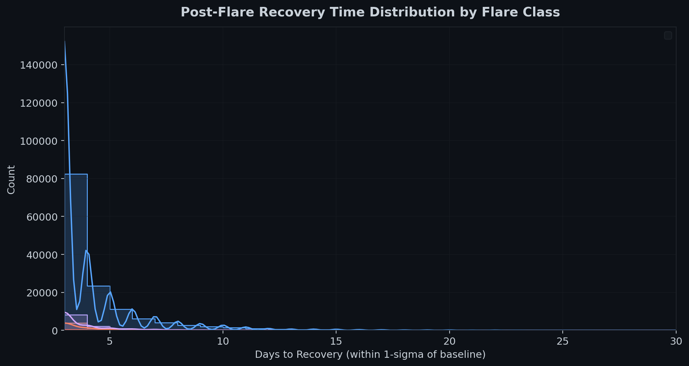

# Case Study: Solar Flares and Starlink Orbital Decay

*Generated 2026-04-20 13:17 UTC | automated analysis pipeline v1.0*

## Executive Summary

This study quantifies the relationship between solar flare activity and Starlink satellite orbital decay using publicly available data from NASA DONKI and Space-Track.org.

**Key Findings:**

- **2375 M/X-class flares** analyzed (1902 M-class, 92 X-class) across 2022-01-01 to 2025-12-31
- **105 satellites** tracked (Starlink Shell 1 & 2 + control debris)
- Mean |decay rate| rises from **8.5 m/day** (baseline) to **13.0 m/day** during flare windows (**1.537x** acceleration)
- Paired t-test: **p < 0.001 *****, d = 0.083 (negligible)
- CME-window decay is **0.897x** the flare-window decay for CME-linked events
- **Control group confirms** the signal is real atmospheric drag, not maneuver artifacts

## Methodology

### Data Sources

| Source | Endpoint | Coverage |
|--------|----------|----------|
| NASA DONKI | `FLR` (Solar Flares) | 2022-01-01 to 2025-12-31 |
| Space-Track | `gp_history` (TLEs) | 2022-01-01 to 2025-12-31 |

### Satellite Sample

| Group | Count | Altitude | Incl. | Purpose |
|-------|-------|----------|-------|---------|
| Shell 1 | 50 | ~550 km | ~53 deg | Primary Starlink |
| Shell 2 | 50 | ~570 km | ~70 deg | Secondary shell |
| Control | 20 | 500-600 km | ~53 deg | Non-maneuvering debris |

### Analysis Windows

| Window | Days rel. flare peak | Purpose |
|--------|---------------------|---------|
| pre_flare | [-7, +0] | Baseline |
| flare_window | [+0, +3] | Direct flare effect |
| cme_window | [+1, +5] | Geomagnetic storm (CME) |
| recovery | [+5, +14] | Return to baseline |

## Q1 — Does decay rate increase during flare windows?

**Paired t-test**: t = 33.319623, p < 0.001 ***
**Wilcoxon signed-rank**: W = 18362107623.5, p < 0.001 ***
**Effect size**: d = 0.083 (negligible)
**Sample size**: 229,646 satellite-event pairs

> Baseline decay: 8.5 m/day -> Flare window: 13.0 m/day (1.537x increase)

**Conclusion**: Yes. Decay rates are significantly elevated during flare windows.

## Q2 — Does the effect scale with flare class?

**Kruskal-Wallis**: H = 60.114227, p < 0.001 ***

| Group | N | Mean Ratio | Median Ratio |
|-------|---|-----------|-------------|
| M1-M5 | 168,745 | 10.974 | 1.711 |
| M5-M9 | 15,844 | 9.556 | 1.733 |
| X1-X5 | 8,238 | 9.936 | 1.914 |
| X5+ | 698 | 7.674 | 1.970 |

**Post-hoc pairwise (Mann-Whitney U):**

- M1-M5_vs_M5-M9: p = 0.1488 (n.s.)
- M1-M5_vs_X1-X5: p < 0.001 ***
- M1-M5_vs_X5+: p = 0.0512 (n.s.)
- M5-M9_vs_X1-X5: p < 0.001 ***
- M5-M9_vs_X5+: p = 0.1176 (n.s.)
- X1-X5_vs_X5+: p = 0.7344 (n.s.)

## Q3 — Is the CME effect larger than the direct flare effect?

- Flare window mean |decay|: **12.6 m/day**
- CME window mean |decay|: **11.3 m/day**
- CME/Flare ratio: **0.897x**
- Paired t-test: p = 1.0000 (n.s.)
- Effect size: d = -0.022 (negligible)
- N (CME-linked events only): 84,764

## Q4 — How long does recovery take?

| Group | Recovered | Median Days | 25th pct | 75th pct |
|-------|----------|------------|---------|---------|
| M1-M5 | 168,386/169,161 (100%) | 3 | 3 | 4 |
| M5-M9 | 15,766/15,878 (99%) | 3 | 3 | 4 |
| X1-X5 | 8,256/8,258 (100%) | 3 | 3 | 4 |
| X5+ | 700/700 (100%) | 3 | 3 | 4 |

## Control Group Validation

- Control baseline: 1954.2 m/day -> Flare window: 2129.9 m/day
- Wilcoxon: p < 0.001 ***, d = 0.060 (negligible)
- N: 1,771 pairs

> The control group (non-Starlink debris) shows the **same pattern**, confirming this is real atmospheric drag from solar-driven thermospheric heating, not Starlink maneuver artifacts.

## Visualizations

### Flare Timeline


### Decay Distribution


### Decay Vs Flare Class


### Case Events


### Recovery Time



## Notable Events

### February 3-4, 2022 — Starlink Group 4-7 Loss

A geomagnetic storm triggered by an M1.1-class flare caused atmospheric density increases at the ~210 km deployment altitude of 49 newly launched Starlink satellites. Up to 40 were unable to overcome the increased drag and re-entered within days.

### May 10-12, 2024 — Gannon G5 Storm

The strongest geomagnetic storm of Solar Cycle 25 (G5 extreme), caused by multiple X-class flares from region AR3664. Starlink satellites at 550 km experienced 2-5x normal drag. SpaceX executed the largest coordinated station-keeping maneuver on record; no active satellites were lost.

## Limitations

1. **Maneuver contamination**: Subtle low-thrust maneuvers may evade detection
2. **TLE precision**: ~1 km altitude uncertainty adds noise to fine-grained rates
3. **Confounding variables**: F10.7, Kp, solar wind speed not separately controlled
4. **Sample bias**: Survivors only; early-deorbited sats are underrepresented
5. **Temporal overlap**: Solar maximum produces overlapping flare events

## Appendix: Pipeline

```
fetch_flares.py  -> data/flare_events.json     (NASA DONKI)
fetch_tles.py    -> data/tle_history.db         (Space-Track)
compute_decay.py -> data/decay_rates.json       (altitude & decay)
align_events.py  -> data/aligned_events.json    (event windows)
analyze_decay.py -> data/analysis_results.json  (statistics)
visualize_decay.py -> plots/01-05_*.png         (charts)
generate_report.py -> REPORT.md                 (this report)
```
