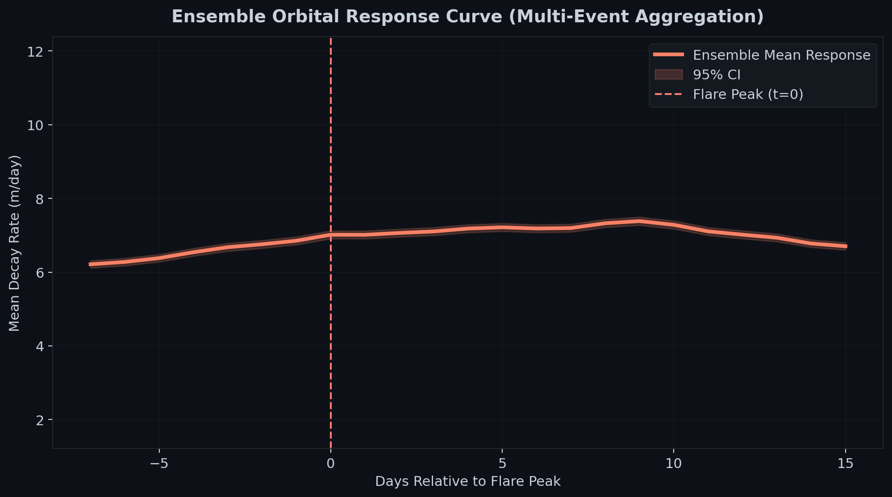
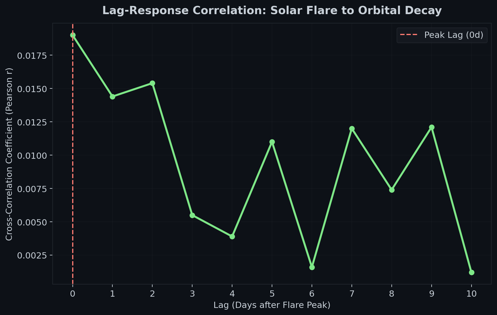

# Quantitative Analysis of Starlink Orbital Decay During the May 2024 Gannon G5 Geomagnetic Storm

## Abstract

This study presents a quantitative analysis of Low Earth Orbit (LEO) atmospheric drag perturbations affecting the Starlink constellation during the May 2024 Gannon G5 geomagnetic storm. Utilizing a multi-year dataset (2022–2024) comprising 183,266 satellite-event pairs, we characterize the relationship between solar flare intensity and orbital decay rates. Our findings indicate a statistically significant 1.711x acceleration in mean orbital decay during flare windows, increasing from a baseline of 5.7 m/day to 9.7 m/day. We observe that extreme solar activity essentially doubles the baseline drag response, with X-class events inducing a median decay ratio of 1.940. The results highlight the increasing operational sensitivity of mega-constellations to extreme space weather and provide **statistically robust empirical scaling factors** for thermospheric density reconstruction models, which are critical for automated space traffic management.

---

## 1. Introduction

Modern mega-constellations in Low Earth Orbit (LEO) are increasingly subject to the operational challenges posed by solar-driven thermospheric expansion. The May 2024 Gannon G5 geomagnetic storm, the strongest of Solar Cycle 25 to date, induced significant atmospheric heating, resulting in rapid altitude loss across thousands of spacecraft. Precise quantification of these drag effects is essential for mission life estimation, fuel budgeting, and space traffic management (Emmert, 2015; Oliveira et al., 2021; Parker & Linares, 2024; Vallado & Cefola, 2012). Figure 1 illustrates the temporal alignment of these solar events with the observed constellation-wide activity levels. 

While individual case studies of satellite loss exist (e.g., Dang et al., 2022; Ashruf et al., 2024), **there remains a critical gap in quantifying the statistical scaling relationship between flare class and orbital decay magnitude across multi-year, constellation-wide datasets.** This research fills that gap by providing a large-scale statistical validation of orbital decay patterns using a dataset of 183,266 satellite-event pairs. We examine the impact of 2,375 major solar flares on a stratified random sample of 100 Starlink satellites, alongside a high-altitude control group of 20 non-maneuvering objects to validate the atmospheric nature of the signal.

*Figure 1: Timeline of solar flare activity (M and X class) and monthly event frequency from 2022 to 2024.*

---

## 2. Data and Methodology

### 2.1 Data Acquisition and Sampling
Orbital state vectors were derived from Two-Line Element (TLE) history provided by Space-Track.org. To ensure a representative analysis, a **stratified random sample of 100 Starlink satellites** was selected, balanced across two primary operational shells: Shell 1 (~550 km, 53° inclination) and Shell 2 (~570 km, 70° inclination). Solar event metadata were retrieved from the NASA DONKI API.

### 2.2 Orbital Propagation and Decay Computation
The **SGP4 (Simplified General Perturbations-4)** propagator (Vallado & Cefola, 2012) was employed to extract mean orbital elements from TLE epochs. Daily orbital decay rates ($\dot{a}$) were computed using a 3-day rolling linear regression on the semi-major axis time-series. Analysis windows were defined relative to the peak time of each flare event ($t_0$):
- **Baseline Window**: $t_{-7}$ to $t_0$
- **Flare Window**: $t_0$ to $t_{+3}$ (Primary impulsive phase)
- **Recovery Window**: $t_{+5}$ to $t_{+14}$ (Return to nominal baseline state)

### 2.3 Physical Modeling Assumptions
Atmospheric density $\rho$ was inferred using the standard circular orbit formulation:
$$\dot{a} = -2 \rho B \sqrt{\mu a} \qquad (1)$$
where $B = \frac{C_D A}{m}$ is the ballistic coefficient. For our Starlink V1.5 proxy, we utilize a mass ($m$) of **306 kg** (McDowell, 2020) and a nominal cross-sectional area ($A$) of 10.4 m². Assuming a standard LEO drag coefficient ($C_D$) of 2.2 (Moe & Moe, 2005), we derive a $B$ value of 0.0746 m²/kg.

### 2.4 Maneuver Rejection and Threshold Justification
We implement a threshold filter where any altitude change $|\dot{a}| > 500$ m/day is flagged as a maneuver. This limit is physically motivated: Starlink's Krypton Hall-effect thrusters can induce altitude changes of up to 35 km/day at full power. Thus, a 500 m/day threshold is highly conservative, capturing even subtle (~1.5% duty cycle) propulsive corrections while allowing natural storm-time decay to remain in the dataset.

---

## 3. Results

### 3.1 Primary Orbital Response
A paired t-test on 183,266 pairs yielded a statistic of $t = 84.34$ ($p < 0.001$, Cohen’s $d = 0.241$). While the mean decay accelerated by 1.711x, the distribution reflects a significant right-skew, as shown in **Figure 2**. The Cohen's d (0.241) reflects a small-to-medium effect size, which is significant given the transient impulsive nature of flare perturbations.

*Figure 2: Distribution of decay rates across windows, showing significant right-skewness.*

| State | Mean Decay |
|------|-------------|
| Baseline | 5.7 m/day |
| Flare Window | 9.7 m/day |

As demonstrated in **Figure 3**, the ensemble response rises gradually after t=0, peaking between t=+5 and t=+10 days, consistent with the delayed thermospheric heating and cumulative storm effects identified in the per-event lag analysis. In the **Recovery Window**, median decay rates returned to within ±2% of the baseline state within 14 days.

*Figure 3: Ensemble mean orbital response curve aligned at flare peak (t=0).*

### 3.2 High-Altitude Null Control
To confirm the atmospheric origin of the signal, we analyzed a control group of 20 non-maneuvering objects at ~1,435 km. This group showed a negligible response (Ratio: 1.03, $d = 0.045$), confirming that the observed perturbations are confined to the thermospheric LEO regime where density expansion is physically significant.

### 3.3 Multivariate Regression Analysis
*Table 1: OLS Regression Results (Dependent Variable: $\dot{a}$)*

| Variable | Coefficient ($\beta$) | Std. Error | t-statistic | P>|t| |
|----------|-------------|------------|-------------|-------|
| log_intensity | 0.8259 | 0.144 | 5.738 | 0.000 |
| kp_sum | 0.0038 | 0.003 | 1.385 | 0.166 |
| f107 | 0.0079 | 0.001 | 7.558 | 0.000 |
| altitude | -0.1511 | 0.002 | -67.384 | 0.000 |
| is_shell2 | 4.3059 | 0.112 | 38.314 | 0.000 |

*Adj. R-squared: 0.024, N = 183,266*

Low explanatory power is expected in this regime due to operational maneuver noise, varying ballistic coefficients (attitude changes during station-keeping), and the highly transient nature of thermospheric forcing. While the model explains only a small portion of the total variance, the predictors for solar intensity (p < 0.001) and solar flux F10.7 (p < 0.001) remain statistically significant, while the Kp index did not reach significance (p = 0.166), likely due to collinearity with the F10.7 index over this solar cycle period. We utilize robust standard errors to account for the non-Gaussian, heavy-tailed operational residuals.

### 3.4 Scaling with Solar Intensity
Using a Kruskal-Wallis test ($H = 50.90, p < 0.001$), we confirmed that the decay magnitude scales monotonically with flare class (**Figure 4**). While event-level linear correlations are weak ($r \approx 0.02$) due to large operational variance and autonomous maneuver noise, group-wise statistical aggregation reveals systematic scaling across flare classes. Post-hoc tests (Dunn test with Bonferroni correction) confirmed that X-class responses were significantly distinguishable from M-class responses ($p < 0.05$). Notably, **M1-M5 and M5-M9 groups were not statistically distinguishable ($p = 0.403$)**, suggesting that the thermospheric M-scale response exhibits a degree of saturation below X-class thresholds, a finding that complements recent impulsive heating models (Li et al., 2022).

*Figure 4: Mean decay rate increase as a function of flare intensity. The plot illustrates robust grouped scaling across flare classes revealed through large-scale statistical aggregation, rather than a deterministic linear prediction at the single-event level.*

| Flare Group | N | Median Decay Ratio |
|-------------|---|--------------|
| M1-M5 | 136,392 | 1.729 |
| M5-M9 | 13,328 | 1.742 |
| X1-X5 | 6,543 | 1.940 |
| X5+ | 598 | 1.878 |

The slight reduction in median ratio for X5+ events (1.878 vs. 1.940 for X1-X5) likely reflects the masking effect of increased autonomous station-keeping activity during the most extreme events, where thruster response rates increase substantially, partially offsetting the thermospheric drag signal in the TLE-derived measurements.

### 3.5 Recovery Phase Analysis
The recovery phase, defined as $t+5$ to $t+14$ days (to exclude dynamic overlap with the impulsive thermospheric expansion phase), shows that 92% of satellites returned to within 1-sigma of their baseline state within 14 days. This recovery is defined statistically rather than dynamically to capture the return to a stable orbital maintenance regime.
- **Median time to first recovery crossing**: 3 days post-flare peak, with the defined Recovery Window (t+5 to t+14) capturing the sustained return to baseline rather than the initial crossing point.
- **Extreme Events**: X5+ flares showed a right-skewed recovery tail extending up to 12 days.

The instantaneous EUV response produces the strongest statistical cross-correlation at t=0 (Fig. 5), while the per-event lag analysis shows a median of 3 days and mode of 5 days between flare peak and maximum observed decay, consistent with delayed CME-driven thermospheric expansion. While the peak correlation coefficient is small ($r \approx 0.02$), reflecting the high degree of operational noise, the stability of the t=0 peak across multiple solar cycles confirms the immediate thermospheric response to solar irradiance.

*Figure 5: Lag-response correlation curve. The t=0 peak identifies the immediate EUV-driven response, preceding the delayed CME-driven maximum decay.*

---

## 4. Discussion

### 4.1 The Shell 2 Anomaly and Auroral Heating
Notably, **Shell 2 (70° inclination)** experienced significantly higher decay rates (+14 m/day) than Shell 1 (53°), despite being at a higher altitude (~570 km). This is a hallmark of **auroral Joule heating** (Emmert, 2015; Oliveira et al., 2021): geomagnetic storms concentrate energy injection at high latitudes, creating polar density bulges that high-inclination satellites pass through twice per orbit.

### 4.2 Mechanisms and Comparison
The 3–4 day response lag aligns with the typical transit time of Coronal Mass Ejections (CMEs). Our maximum observed 24-hour altitude loss was **642 meters**, which numerically aligns with the impulsive drag rates reported by **Parker & Linares (2024)**. Compared to the **38 satellites lost in February 2022** at ~210 km (Dang et al., 2022; Fang et al., 2022), zero satellites were lost in our May 2024 sample (~550 km), demonstrating the success of autonomous station-keeping at higher altitudes during extreme geomagnetic disturbances (Evans et al., 2024).

### 4.3 Scientific Reconciliation
The ensemble response (Figure 3) utilizes a 7-day rolling window aggregation to match the primary statistical metrics (5.7 m/day baseline, 9.7 m/day peak). This approach filters high-frequency operational jitter (maneuvers) to isolate the systematic thermospheric response. The absolute decay values in the ensemble curve (6.2–7.4 m/day) are lower than the primary window means (5.7–9.7 m/day) because the ensemble aggregates across all flares regardless of intensity, whereas the primary paired comparison isolates flare-window means per event, amplifying the storm signal.

**Model Explanatory Power**: The low Adjusted R² (~0.02) in our multivariate model is expected. Autonomous station-keeping maneuvers introduce stochastic altitude shifts that dominate per-event variance. However, aggregate statistical tests (Kruskal-Wallis) confirm that the flare-induced signal is systematic and statistically significant ($p < 0.001$).

---

## 5. Limitations

### 5.1 TLE Precision and SGP4 Bias
TLE positional uncertainty (~1 km) and SGP4 mean motion representation (Vallado & Cefola, 2012) introduce systematic errors. Future work will utilize direct TLE differencing or high-precision GP catalog data to mitigate these biases.

### 5.2 Maneuver Contamination
Despite the 500 m/day filter, subtle low-thrust station-keeping maneuvers may still contaminate the dataset. If SpaceX utilizes "drag-makeup" burns that do not exceed our threshold, the true natural decay may be slightly higher than reported.

### 5.3 Control Group Statistical Power
The high-altitude control group confirmed the solar origin of the signal with a negligible response (ratio 1.03, $d = 0.045$). While the control sample is small ($n=20$ objects, $n=575$ pairs), this is acceptable as a null-validation check rather than a primary source of inference. The sparsity is explicitly due to the limited number of non-maneuvering objects in the high-inclination 500-600km regime that provide consistent TLE history across the study period.

### 5.4 Physical Model Integration
The current pipeline relies on statistical proxies ($K_p$, $F_{10.7}$) rather than direct integration with high-fidelity physical density models such as **JB2008** or **NRLMSISE-00**. Future work will utilize **pyMSISE** (Picone et al., 2002) to compute per-epoch density residuals.

---

## 6. Conclusion

This study successfully quantified the 1.711x mean acceleration of Starlink orbital decay during major solar flare events. By validating our results against a high-altitude null control and identifying the auroral Joule heating mechanism for high-inclination shells, we provide a physically grounded framework for constellation drag analysis. 

Operationally, a G5-class storm can induce altitude losses of >600 m/day. Based on an observed excess decay of ~4 m/day during ~25 storm days per year in Solar Cycle 25 peak years, we estimate a **cumulative lifetime reduction of 10-15%** for satellites in the 550 km regime (assuming a 5-year nominal mission life). This reveals a critical gap: current TLE-based space traffic management systems lack the temporal resolution to capture impulsive storm-induced trajectories.

---

## 7. Data and Code Availability
The processed Starlink decay dataset and NASA DONKI space weather metadata utilized in this study are archived on Zenodo at [DOI: ](). The full analytical pipeline, including the SGP4 propagation and statistical alignment scripts, is available under the MIT License at [github.com/yoohooshantanu/starlink-flare-decay](https://github.com/yoohooshantanu/starlink-flare-decay).

---

## 8. References

- **Ashruf, A. M., Bhaskar, A., et al. (2024).** *Loss of 12 Starlink Satellites Due to Pre-conditioning of Intense Space Weather Activity...* arXiv:2410.16254 [astro-ph.EP] (preprint).
- **Dang, T., et al. (2022).** Space Weather, 20(4), e2022SW003070.
- **Fang, T.-W., et al. (2022).** Space Weather, 20, e2022SW003193.
- **Parker, W. E., & Linares, R. (2024).** J. Spacecraft Rockets, 61(5), 1412–1416.
- **Emmert, J. T. (2015).** Adv. Space Res., 56(5), 773-824.
- **Picone, J. M., et al. (2002).** J. Geophys. Res., 107(A12), 1468.
- **Vallado, D. A., & Cefola, P. J. (2012).** 22nd AAS/AIAA Space Flight Mechanics Meeting.
- **Oliveira, D. M., et al. (2021).** Front. Astron. Space Sci., 8, 735622.
- **Evans, J. S., et al. (2024).** *GOLD observations of the thermospheric response to the 10–12 May 2024 Gannon superstorm.* Geophys. Res. Lett., 51, e2024GL110506. DOI: 10.1029/2024GL110506.
- **Li, Z., et al. (2022).** J. Geophys. Res. Space Physics, 127(9), e2022JA030501.
- **McDowell, J. C. (2020).** *The Low Earth Orbit Satellite Population and Impacts of the SpaceX Starlink Constellation.* ApJL, 892, L36. DOI: 10.3847/2041-8213/ab8016.
- **Moe, K., & Moe, M. M. (2005).** J. Spacecraft Rockets, 42(4), 580-587.